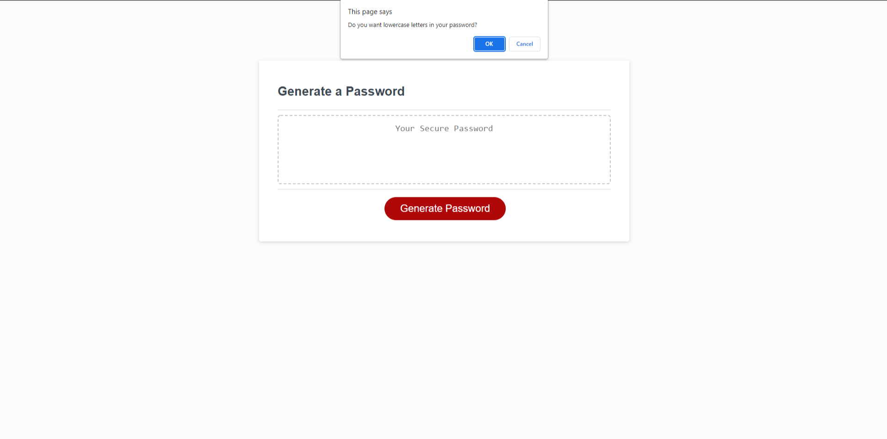

# Random Password Generator

## Table of Contents
1. [Description](#Description)
 2. [Visual](#Visual)
 
## Description
 This is a random password generator that give you a random set of values by answering a few questions such as
 if you want lowercase or uppercase letters, numbers, and or special characters in your password.
 It also requires you to choose a character value set before you are able to set the amount of characters you want in your password. After answering a few questions the random password generater will give you a random set of values in which it would be your new password if you wanted.

 ## Visual
 